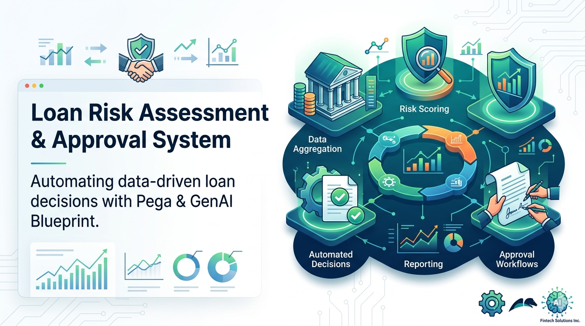

<div align="center">
  
</div>

# Loan Approval System

An AI-powered enterprise banking workflow application designed to automate loan evaluation, risk assessment, compliance verification, and approval decisioning using intelligent business rules and workflow automation.

## Features

- **Automated Loan Evaluation** - Intelligent assessment of loan applications
- **Risk Assessment** - AI-powered risk evaluation and scoring
- **Compliance Verification** - Automated regulatory compliance checking
- **Approval Decisioning** - Smart workflow-based decision making
- **Business Rules Engine** - Customizable business logic automation

## Tech Stack

- **Frontend:** TypeScript (98.4%), React
- **Styling:** CSS (1.3%)
- **Markup:** HTML (0.3%)

## Getting Started

### Prerequisites

- Node.js (v16 or higher)
- npm or yarn

### Installation

1. Clone the repository:
   ```bash
   git clone https://github.com/raghureddy-fraudai/loan-approval-system.git
   cd loan-approval-system
   ```

2. Install dependencies:
   ```bash
   npm install
   ```

3. Configure environment variables:
   - Create a `.env.local` file in the root directory
   - Add required configuration variables

4. Run the development server:
   ```bash
   npm run dev
   ```

5. Open your browser and navigate to `http://localhost:3000`

## Project Structure

```
loan-approval-system/
├── src/
│   ├── components/
│   ├── pages/
│   ├── services/
│   └── styles/
├── public/
├── package.json
└── README.md
```

## License

This project is licensed under the MIT License - see the LICENSE file for details.

## Support

For issues, questions, or contributions, please open an issue or submit a pull request on GitHub.
